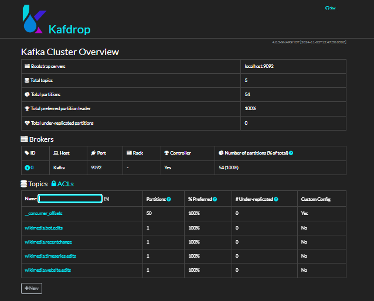
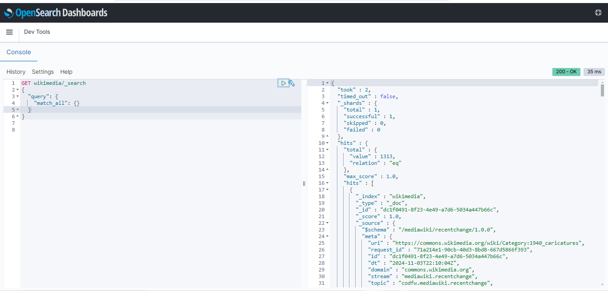

# Wikimedia Kafka, OpenSearch, and Spark Streaming Integration

This repository is a follow-up project from the course *Apache Kafka Series - Learn Apache Kafka for Beginners v3* by Stephane Maarek, provided by Conduktor Kafkademy. In the course, two main projects were introduced, which I have implemented here using Python to connect with Kafka and OpenSearch.

## Projects Overview

### 1. Kafka Producer and OpenSearch Consumer
In this first project, we created a Kafka topic named `wikimedia.recentchange`, which consists of a single partition. The Kafka Producer streams recent changes from Wikimedia, and the OpenSearch Consumer reads these messages from Kafka and indexes them in OpenSearch for search and analytics.

- **Producer**: Uses the Wikimedia API to stream data to the Kafka topic `wikimedia.recentchange`.
- **Consumer**: Reads from the `wikimedia.recentchange` topic and sends the data to an OpenSearch index for further exploration. I utilized [Kafdrop](https://github.com/obsidiandynamics/kafdrop) as the Kafka UI to monitor the Kafka cluster and inspect topics.

### 2. Spark Streaming with Kafka
In the second project, instead of using Kafka Streams as demonstrated in the course, I implemented Spark Streaming to connect to Kafka, process data, and create additional Kafka topics. This project includes real-time processing and aggregation of the data streamed from Wikimedia.

- **Spark Streaming Application**: Reads data from the `wikimedia.recentchange` Kafka topic and performs the following aggregations:
  - **Bot Edits**: Aggregates bot edits over time and publishes results to a new topic, `wikimedia.stats.bots`.
  - **Website Edits**: Tracks edit counts per website and streams results to `wikimedia.stats.website`.
  - **Time Series Edits**: Aggregates edit counts by type over time, with output sent to `wikimedia.stats.timeseries`.

These aggregations provide insights into the types of edits being made, the frequency of bot versus human edits, and edit patterns over time.

## Directory Structure
- `wikimedia_kafka_producer.py`: Kafka Producer code to stream data from Wikimedia.
- `wikimedia_opensearch_consumer.py`: Kafka Consumer code to consume data and store it in OpenSearch.
- `wikimedia_spark_streaming.py`: Spark Streaming code to process data in real-time.

### Kafdrop Kafka Cluster Overview

### OpenSearch Dashboards

## Note
This repository does not include the setup steps for installing Kafdrop UI, OpenSearch, or preparing the Python environment. These were configured prior to coding to ensure the Python environment, Kafdrop, and OpenSearch were up and running.
